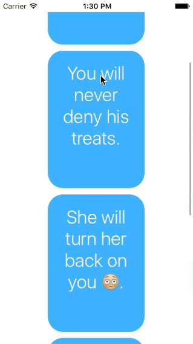

# CustomTransition
This is the repository for the custom UIViewController transition example.

This is a slight variation on the pet example Josh talked about. In this version, we are loading the "clues" for each pet into a UICollectionView. 

When one of the cells is tapped, we expand the cell while simulateously fading in the picture of the pet and his/her name.

# Known Issue

If the transition is cancelled, the corners "jump" its current corner radius to 25, and then to 0.
